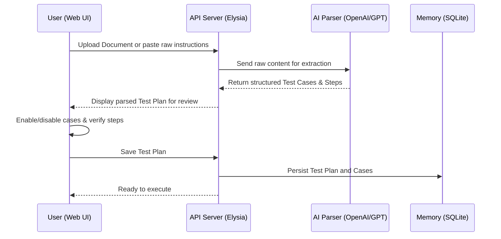
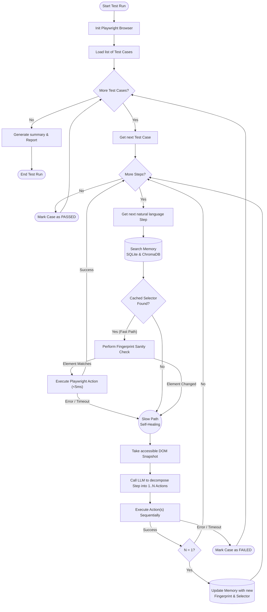

# 🔄 Core Workflows

This document illustrates the two primary workflows of the **AI QA Agent**: Plan Creation and Test Execution (Self-Healing).

## 1. Parse & Create Test Plan

When a user provides testing documentation (e.g. a PR description, User Story, or raw instructions), the AI parses it into a structured Test Plan containing individual test cases and steps.

## 2. Test Execution & Self-Healing (Cognitive Runner)

This is the core execution loop. It relies on a high-speed **Fast Path** (instant execution using memory) and a robust **Slow Path** (AI-driven self-healing when UI changes occur).

